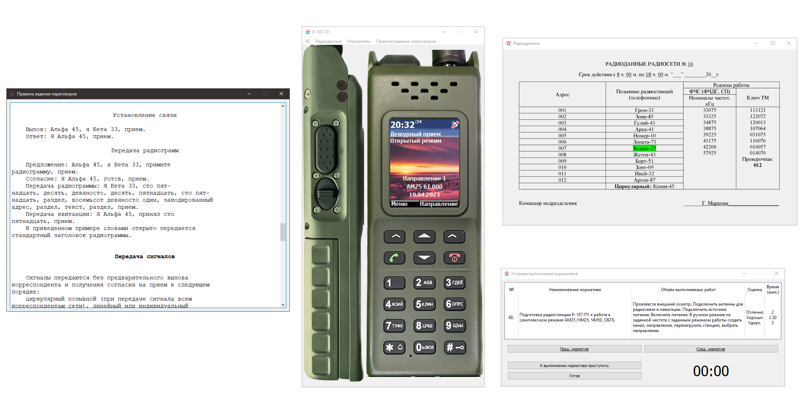
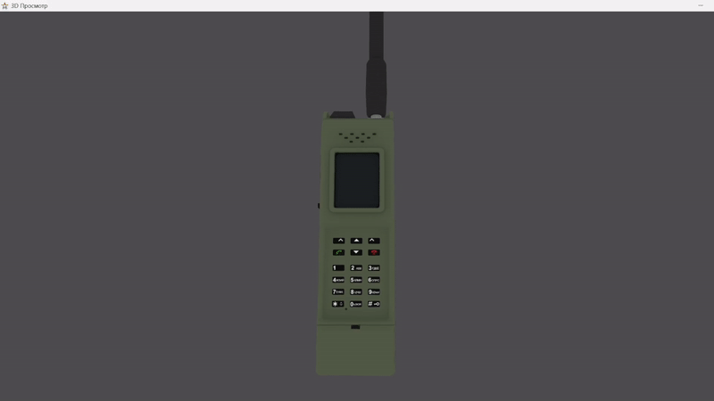

# Учебный тренажер радиостанции 6-го поколения «Азарт»

## Используемые технологии
Для разработки тренажера были использованы язык программирования **C++** и фреймворк **Qt**. Выбор данного набора технологий обусловлен высокими показателями эффективности приложений, написанных с его помощью, а также высокой степенью их платформонезависимости и возможностью запуска без установки, что позволяет использовать тренажер не только на домашних компьютерах курсантов, но и на большинстве ЭВМ военных учебных центров, в том числе под управлением операционных систем Rosa и Astra Linux.

## Основные составляющие тренажера
Тренажер имеет пользовательский интерфейс, объединяющий в себе следующие функции:
 - Подготовка радиостанции к работе и её эксплуатация;
- Отображение бланка радиоданных;
- Отображение перечня условий выполнения нормативов № 68, 69, 70, 71, 72 и 73;
- Краткая справка по правилам ведения переговоров на средствах связи;

Перечисленные функции логически сгруппированы и выполнены в виде модальных окон тренажера, что позволяет добиться максимальной эффективности в использовании пространства рабочего стола пользователя, а также повышает степень концентрации курсантов на выполняемой задаче благодаря отсутствию отвлекающих факторов.

Несмотря на удобство использования имеющегося пользовательского интерфейса, отражающего внешний вид радиостанции в двух проекциях, он не предоставляет всей необходимой информации о расположении основных элементов радиостанции.

Поэтому, в интерфейс тренажера была добавлена трехмерная модель радиостанции и средство её визуализации.

Данное средство позволяет эффективно отображать трехмерную модель на экране пользовательского компьютера за счет использования аппаратного ускорения отрисовки трехмерной графики по открытому стандарту **OpenGL**.
Также, средство визуализации позволяет пользователю применять к модели основные аффинные преобразования (поворот, масштаб, смещение) для подробного изучения внешнего вида радиостанции и её элементов.

Для достижения наиболее реалистичного опыта обучающегося при выполнении вхождения в связь и эксплуатации необходимо реализовать обмен данными по сети для передачи канала тональной частоты.

Исходя из этого, обмен данными по сети решено осуществлять при помощи простого [сервера](radioserver.py), запущенного на одном из компьютеров в локальной вычислительной сети (ЛВС) по протоколу TCP.

Использование этого протокола позволяет легко организовать обмен данными в сети при сохранении удовлетворительной скорости передачи звука, а работа по локальной сети позволяет использовать разработанный тренажер в различных условиях проведения занятий.

Параметры передаваемого сигнала соответствуют параметрам основного цифрового канала (ОЦК):
- частота дискретизации – 8 кГц
- глубина квантования – 8 бит

## Практическая значимость работы
Заключается в предоставлении каждому курсанту, обучающемуся в военном учебном центре возможности работать на радиостанции, представленной в этом тренажере.
- Пользовательский интерфейс предоставляет обширные возможности для изучения порядка выполнения нормативов.
- Средство визуализации трехмерной модели позволяет подробно изучить некоторые ТТД радиостанции, а также расположение основных элементов управления на её корпусе.

Особенности реализации входа в связь позволяют использовать тренажер при занятиях в ВУЦ с разделением на пары и группы в учебных аудиториях и обеспечивают возможность удаленной и (или) самостоятельной работы обучающихся дома (при использовании дополнительных средств создания виртуальных частных сетей).

Тренажер не требует установки, что позволяет использовать его в аудиториях военного учебного центра (установка программного обеспечения на компьютеры в них запрещена). Программа является полностью кроссплатформенной, что позволяет использовать её на компьютерах с различными ОС семейства Microsoft Windows или Linux.
